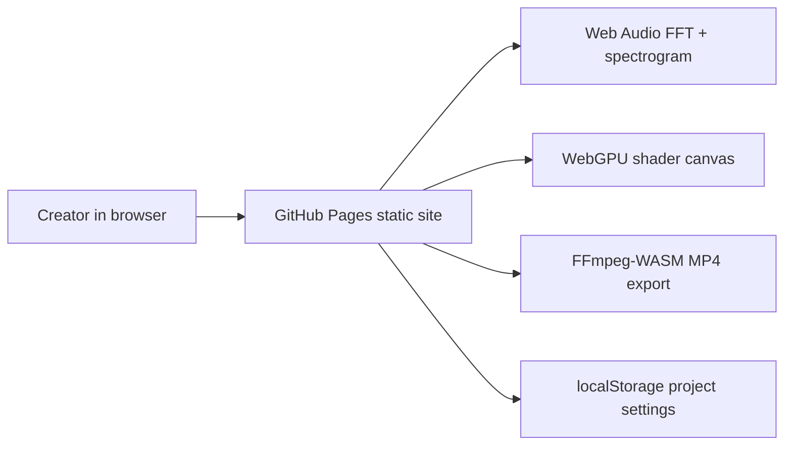

# Shaderwave Studio

Live: https://baditaflorin.github.io/shaderwave-studio/

Repository: https://github.com/baditaflorin/shaderwave-studio

Support: https://www.paypal.com/paypalme/florinbadita

Drop an MP3, bind FFT bands to WebGPU shaders, preview audio-reactive visuals, and export MP4 entirely in the browser.

## Quickstart

```bash
npm install
make install-hooks
make dev
make build
make smoke
```

## Architecture



Docs:

https://github.com/baditaflorin/shaderwave-studio/tree/main/docs/adr

https://github.com/baditaflorin/shaderwave-studio/blob/main/docs/architecture.md

https://github.com/baditaflorin/shaderwave-studio/blob/main/docs/deploy.md
