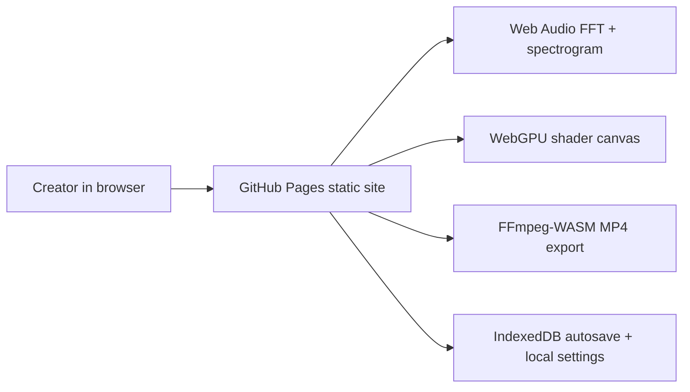

# Shaderwave Studio

Live: https://baditaflorin.github.io/shaderwave-studio/

Repository: https://github.com/baditaflorin/shaderwave-studio

Support: https://www.paypal.com/paypalme/florinbadita

Drop an MP3, bind FFT bands to WebGPU shaders, preview audio-reactive visuals, and export MP4 entirely in the browser.


## Verified Features

- Browser-only audio analysis, spectrogram preview, and MP4 export on GitHub Pages
- Audio health warnings with confidence, suggested export settings, and deterministic provenance
- Save project state to JSON, restore from pasted JSON or scene link, and local autosave restore
- GitHub star link, PayPal support link, and visible build version + commit on the live page
- `?debug=1` debug overlay for project/state inspection

## Quickstart

```bash
npm install
make install-hooks
make dev
make build
make smoke
```

## Stranger Workflow

1. Load your audio with `Choose` or drag and drop.
2. Inspect the health panel and apply the suggested export if it matches your intent.
3. Tune the shader preset and intensity controls.
4. Export MP4, download provenance, or save the whole project state.
5. Reload the page and continue from autosave, or paste/import the saved project elsewhere.

## Limitations

- Multi-file batch ingest is still out of scope.
- Share links only work for sessions small enough to fit in the URL hash; larger audio projects should use saved JSON.
- Audio URL ingest is not built because static GitHub Pages cannot reliably bypass third-party CORS.
- Export renders from the deterministic Canvas path so MP4 output stays reproducible even when preview uses WebGPU.

## Architecture



Docs:

https://github.com/baditaflorin/shaderwave-studio/tree/main/docs/adr

https://github.com/baditaflorin/shaderwave-studio/blob/main/docs/architecture.md

https://github.com/baditaflorin/shaderwave-studio/blob/main/docs/deploy.md

https://github.com/baditaflorin/shaderwave-studio/blob/main/docs/postmortem-phase3.md
