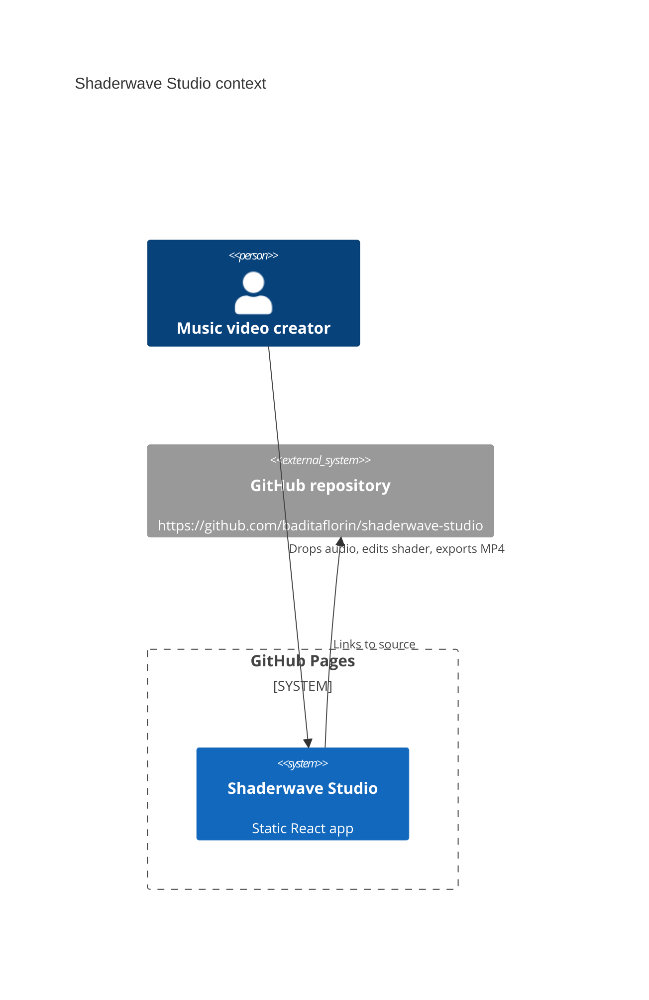
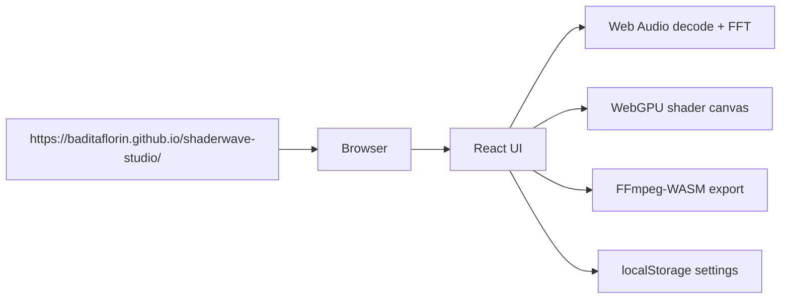

# Architecture

## Context

```mermaid
C4Context
  title Shaderwave Studio context
  Person(creator, "Music video creator")
  System_Boundary(pages, "GitHub Pages") {
    System(app, "Shaderwave Studio", "Static React app")
  }
  System_Ext(github, "GitHub repository", "https://github.com/baditaflorin/shaderwave-studio")
  Rel(creator, app, "Drops audio, edits shader, exports MP4")
  Rel(app, github, "Links to source")
```

## Container

```mermaid
flowchart LR
  Browser["Browser"]
  Browser --> UI["React UI"]
  UI --> Audio["Web Audio decode + FFT"]
  UI --> Canvas["WebGPU shader canvas"]
  UI --> Export["FFmpeg-WASM export"]
  UI --> Store["localStorage settings"]
  Pages["https://baditaflorin.github.io/shaderwave-studio/"] --> Browser
```
